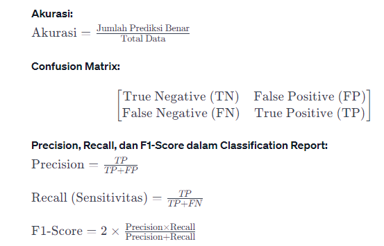

# Laporan Proyek Machine Learning

### Nama : Putri Carellilas Fony

### Nim : 211351113

### Kelas : Pagi A

## Domain Proyek

Penyakit paru-paru adalah salah satu penyebab kematian tertinggi di dunia. Penyakit ini dapat disebabkan oleh berbagai faktor, termasuk Usia, Jenis_Kelamin, Merokok, Bekerja, Rumah_Tangga, Aktivitas_Begadang, Aktivitas_Olahraga, Asuransi,dan Penyakit_Bawaan

## Business Understanding

Bisa mempredic terkena penyakit paru-paru atau tidak tanpa harus melibatkan prosedur yang rumit dan peralatan mahal. 

### Problem Statements

Dalam kasus ini, masalah yang saya jelajahi adalah masalah diagnosa penyakit paru-paru saat ini melibatkan pemeriksaan fisik, tes darah, dan tes pencitraan yang memakan waktu dan biaya tinggi. Tantangan ini menyebabkan kesulitan akses dan keterbatasan bagi individu untuk mendapatkan pemeriksaan secara rutin.

### Goals

Tujuan dari proyek ini untuk memberikan aksesibilitas lebih luas terhadap prediksi risiko penyakit paru-paru.untuk dapat diakses dengan mudah oleh individu dan membantu dalam deteksi dini penyakit paru-paru.

### Solution statements

Pengembangan Aplikasi Web Prediksi terkena penyakit paru-paru: untuk mengatasi permasalahan prediksi terkena penyakit paru-paru.Aplikasi ini akan memanfaatkan data terkait faktor-faktor risiko yang dapat diukur untuk memberikan prediksi risiko seseorang terkena penyakit paru-paru. Dengan demikian, diharapkan aplikasi ini dapat membantu dalam deteksi dini penyakit paru-paru.

## Data Understanding

Aktivitas merokok menjadi salah satu penyebab sumber penyakit, tidak hanya berdampak pada perokok aktif saja namun orang-orang di sekitar perokok atau perokok pasif pun turut terkena dampaknya. Perokok pasif lebih mungkin mengalami dampak penyakit seperti halnya perokok aktif. Namun jika 1% populasi manusia yang ada menjadi perokok pasif maka jumlah
dokter spesialis paru yang ada tidak akan mampu menanganinya. Ini merupakan permasalahan yang harus diatasi. Pengguna dapat melakukan diagnosis awal terhadap gejala yang diderita serta pengobatannya melalui Sistem Pakar. Pada penelitian ini sistem pakar menggunakan metode kepastian faktor yang dapat memberikan kepastian suatu fakta. Perhitungan dilakukan berdasarkan nilai keyakinan seorang ahli terhadap gejala suatu penyakit. Sistem pakar yang dihasilkan diberi nama Diagperosif dimana sistem mendiagnosis penyakit berdasarkan gejala yang dimasukkan oleh pengguna. Penyakit yang dapat didiagnosis dengan Diagperosif adalah asma, bronkitis, polisi, dan kanker paru-paru.
<br>[Prediksi Terkena Penyakit Paru-paru] (https://www.kaggle.com/datasets/andot03bsrc/dataset-predic-terkena-penyakit-paruparu/data).</br>

### Variabel-variabel  Prediksi BodyFat(Lemak Tubuh) adalah sebagai berikut:
| No | Nama Variable    | Keterangan |Type Data|
|----|------------------|-----------|------------|
|1| No | (1-30rb)|(int64)|
|2| Usia |  Dibagi menjadi 2 yaitu muda dan tua (Muda,dari 30rb data mendapatkan 51% atau 15383) (Tua,dari 30rb data mendapatkan 49% atau 14617) |(object)
|3| Jenis_Kelamin | Dibagi menjadi 2 yaitu Wanita dan Pria (Wanita,dari 30rb data mendapatkan 74% atau 22225) (Pria,dari 30rb data mendapatkan 26% atau 7775) |(object)
|4| Merokok | Dibagi menjadi 2 yaitu Aktif dan Pasif (Aktif,dari 30rb data mendapatkan 51% atau 15210) ( Pasif,dari 30rb data mendapatkan 49% atau 14790)| (object)
|5| Bekerja | Dibagi menjadi 2 yaitu Ya dan Tidak (Ya,dari 30rb data mendapatkan 63% atau 18964) (Tidakdari 30rb data mendapatkan 37% atau 11036) |(object)
|6| Rumah_Tangga | Dibagi menjadi 2 yaitu Ya dan Tidak (Ya,dari 30rb data mendapatkan 51% atau 15425 ) (Tidak,dari 30rb data mendapatkan  49% atau 14575)| (object)
|7| Aktivitas_Begadang | Dibagi menjadi 2 yaitu Ya dan Tidak (Ya,dari 30rb data mendapatkan 58% atau 17548) (Tidak,dari 30rb data mendapatkan 42% atau 12452)| (object)
|8| Aktivitas_Olahraga | Dibagi menjadi 2 yaitu Jarang dan Sering (Jarang,dari 30rb data mendapatkan 60% atau 17994) (Sering,dari 30rb data mendapatkan 40% atau 12006)| (object)
|9| Asuransi | Dibagi menjadi 2 yaitu Ada dan Tidak (Ada,dari 30rb data mendapatkan 71% atau 21239) (Tidak,dari 30rb data mendapatkan 29% atau 8761)| (object)
|10| Penyakit_Bawaan | Dibagi menjadi 2 yaitu Ada dan Tidak (Ada,dari 30rb data mendapatkan 65% atau 19350) (Tidak,dari 30rb data mendapatkan 36% atau 10650)| (object)
|11| Hasil | Dibagi menjadi 2 yaitu Tidak Dan Ya (Tidak,dari 30rb data mendapatkan 52% atau 15648) (Ya,dari 30rb data mendapatkan 48% atau 14352)|  (object)

## Data Preparation

### Data Collection

Untuk data collection ini, saya mendapatkan dataset yang nantinya digunakan dari website kaggle dengan nama dataset DATASET PREDIC TERKENA PENYAKIT PARU-PARU, jika anda tertarik dengan datasetnya, anda bisa click link diatas.

### Data Discovery And Profiling

Untuk bagian ini, kita akan menggunakan teknik EDA. <br>
#### Pertama kita mengimport semua library yang dibutuhkan,

```bash
import numpy as np
import pandas as pd
import matplotlib.pyplot as plt
import seaborn as sns
```

Karena kita menggunakan google colab untuk mengerjakannya maka kita akan import files juga,

```bash
from google.colab import files
```

Lalu mengupload token kaggle agar nanti bisa mendownload sebuah dataset dari kaggle melalui google colab

```bash
file.upload()
```

Setelah mengupload filenya, maka kita akan lanjut dengan membuat sebuah folder untuk menyimpan file kaggle.json yang sudah diupload tadi

```bash
!mkdir -p ~/.kaggle
!cp kaggle.json ~/.kaggle/
!chmod 600 ~/.kaggle/kaggle.json
!ls ~/.kaggle
```

Done, lalu mari kita download datasetsnya

```bash
!kaggle datasets download -d andot03bsrc/dataset-predic-terkena-penyakit-paruparu
```

Selanjutnya kita harus extract file yang tadi telah didownload

```bash
!mkdir dataset-predic-terkena-penyakit-paruparu
!unzip dataset-predic-terkena-penyakit-paruparu.zip -d dataset-predic-terkena-penyakit-paruparu
!ls dataset-predic-terkena-penyakit-paruparu
```
#### kedua kita melakukan Data discovery

Memasukkan file csv yang telah diextract pada sebuah variable

```bash
df = pd.read_csv('predic_tabel.csv')
df.shape
```

Untuk melihat beberapa baris pertama dari sebuah DataFrame.,

```bash
df.head()
```

Untuk melihat mengenai type data dari masing masing kolom kita bisa menggunakan property info,

```bash
df.info()
```

Untuk melihat mengenai Nilai count, Nilai mean, Nilai std, Nilai min, berapa 25% dari data, berapa 50% dari data, berapa 75% dari data, Nilai max

```bash
df.describe()
```

Untuk melihat apakah ada data yang nul

```bash
df.isnull().sum()
```

Untuk melihat pembagian Setiap colum di bagi 2 dan masing-masing nilai datanya

```bash
col_names = ['Usia', 'Jenis_Kelamin', 'Merokok', 'Bekerja', 'Rumah_Tangga', 'Aktivitas_Begadang', 'Aktivitas_Olahraga', 'Asuransi', 'Penyakit_Bawaan', 'Hasil']

for col in col_names:
    print (df[col].value_counts())
```

##### Transformasi Dataset

Memisahkan columns numerical dan catgcols 

```bash
numerical = []
catgcols =[]

for col in df.columns:
  if df[col].dtype=="float64":
    numerical.append(col)
  else:
    catgcols.append(col)

for col in df.columns:
  if col in numerical:
    df[col].fillna(df[col].median(), inplace=True)
  else:
    df[col].fillna(df[col].mode()[0], inplace=True)
```

Untuk melihat colums yang termasuk numerical

```bash
numerical
```

Untuk melihat colums yang termasuk catgcols

```bash
catgcols
```

Mentransform data (colums yang termasuk catgcols menjadi type data int64)

```bash
from sklearn.preprocessing import LabelEncoder

le = LabelEncoder()

for col in catgcols:
    df[col] = le.fit_transform(df[col])
```

Untuk melihat beberapa baris pertama dari sebuah DataFrame yang sudah di transform

```bash
df.head()
```

#### Eda

Untuk melihat gambar korelasi columns

```bash
corr = df.corr()
fig, ax = plt.subplots(figsize=(10,10))
sns.heatmap(corr, annot=True, square=True ,ax=ax)
plt.yticks(rotation=360)
plt.show()
```


Untuk melihat gambar apakah ada data yang null

```bash
sns.heatmap(df.isnull())
```


```bash
dari gambar di atas dapat di jelaskan bahwa Tidak ada data yang null
```

Untuk melihat jika memasukkan data merokok dan usia maka hasil nya ya atau tidak terkena penyakit paru-paru

```bash
sns.relplot(x='Merokok', y='Usia', hue='Hasil', data=df);
```


Untuk melihat jika memasukkan data Penyakit_Bawaan dan Jenis_Kelamin maka hasil nya ya atau tidak terkena penyakit paru-paru

```bash
sns.relplot(x='Penyakit_Bawaan', y='Jenis_Kelamin', hue='Hasil', data=df);
```


Untuk melihat jika memasukkan data Bekerja dan Rumah_Tangga maka hasil nya ya atau tidak terkena penyakit paru-paru

```bash
sns.relplot(x='Bekerja', y='Rumah_Tangga', hue='Hasil', data=df);
```


membuat tipikal grafik dalam bentuk barplot dari Usia dengan jumlah data masing-masing

```bash
df.Usia.value_counts().plot(kind='bar')
plt.xlabel("Usia")
plt.ylabel("Jumlah unit")
plt.show()
```


membuat tipikal grafik dalam bentuk barplot dari Jenis_Kelamin dengan jumlah data masing-masing

```bash
df.Jenis_Kelamin.value_counts().plot(kind='bar')
plt.xlabel("Jenis_Kelamin")
plt.ylabel("Jumlah unit")
plt.show()
```


membuat tipikal grafik dalam bentuk barplot dari Merokok dengan jumlah data masing-masing

```bash
df.Merokok.value_counts().plot(kind='bar')
plt.xlabel("Merokok")
plt.ylabel("Jumlah unit")
plt.show()
```


membuat tipikal grafik dalam bentuk barplot dari Bekerja dengan jumlah data masing-masing

```bash
df.Bekerja.value_counts().plot(kind='bar')
plt.xlabel("Bekerja")
plt.ylabel("Jumlah unit")
plt.show()
```


membuat tipikal grafik dalam bentuk barplot dari Rumah_Tangga dengan jumlah data masing-masing

```bash
df.Rumah_Tangga.value_counts().plot(kind='bar')
plt.xlabel("Rumah_Tangga")
plt.ylabel("Jumlah unit")
plt.show()
```


membuat tipikal grafik dalam bentuk barplot dari Aktivitas_Begadang dengan jumlah data masing-masing

```bash
df.Aktivitas_Begadang.value_counts().plot(kind='bar')
plt.xlabel("Aktivitas_Begadang")
plt.ylabel("Jumlah unit")
plt.show()
```


membuat tipikal grafik dalam bentuk barplot dari Aktivitas_Olahraga dengan jumlah data masing-masing

```bash
df.Aktivitas_Olahraga.value_counts().plot(kind='bar')
plt.xlabel("Aktivitas_Olahraga")
plt.ylabel("Jumlah unit")
plt.show()
```


membuat tipikal grafik dalam bentuk barplot dari Asuransi dengan jumlah data masing-masing

```bash
df.Asuransi.value_counts().plot(kind='bar')
plt.xlabel("Asuransi")
plt.ylabel("Jumlah unit")
plt.show()
```


membuat tipikal grafik dalam bentuk barplot dari Penyakit_Bawaan dengan jumlah data masing-masing

```bash
df.Penyakit_Bawaan.value_counts().plot(kind='bar')
plt.xlabel("Penyakit_Bawaan")
plt.ylabel("Jumlah unit")
plt.show()
```


membuat tipikal grafik dalam bentuk barplot dari Hasil dengan jumlah data masing-masing

```bash
df.Hasil.value_counts().plot(kind='bar')
plt.xlabel("Hasil")
plt.ylabel("Jumlah unit")
plt.show()
```


kita berhasil melakukan plotdataset, mendeskripsikan dataset dan memberikan informasi dari grafik.

#### Data Preparation

Menghapus columns No

```bash
df.drop(['No'], axis=1)
```

Menyimpan csv yang sudah diganti

```bash
df.to_csv('Penyakit_Paru.csv',index=False)
```

Menuntukan ind_col dan dep_col

```bash
ind_col = [col for col in df.columns if col != 'Hasil']
dep_col = 'Hasil'
```

Menentukan data yang termasuk x= feature dan y= label

```bash
x = df[ind_col] #feature
y = df[dep_col] #label
```

mari lanjut dengan modeling.

## Modeling

mari kita import library yang nanti akan digunakan,

``` bash
from sklearn.model_selection import train_test_split

x_train, x_test, y_train, y_test = train_test_split(x, y, test_size=0.20, random_state=0)
```

Membuat model DecisionTreeClassifier dan memasukkan modul dari sklearn(memasukkan library) dan kita bisa melihat score dari model kita

 ``` bash
from sklearn.metrics import accuracy_score, confusion_matrix, classification_report
from sklearn.tree import DecisionTreeClassifier

dtc = DecisionTreeClassifier(
    ccp_alpha=0.0, class_weight=None, criterion='entropy',
    max_depth=4, max_features=None, max_leaf_nodes=None,
    min_impurity_decrease=0.0, min_samples_leaf=1,
    min_samples_split=2, min_weight_fraction_leaf=0.0,
    random_state=42, splitter='best'
)

model = dtc.fit(x_train, y_train)

dtc_acc = accuracy_score(y_test, dtc.predict(x_test))

print(f"akurasi data training = {accuracy_score(y_train, dtc.predict(x_train))}")
print(f"akurasi data testing = {dtc_acc} \n")

print(f"confusin matrix : \n{confusion_matrix(y_test, dtc.predict(x_test))}\n")
confusion = confusion_matrix(y_test,dtc.predict(x_test))
tn, fp, fn, tp =confusion.ravel()
print(f"classification report : \n {classification_report(y_test, dtc.predict(x_test))}")
 ```
Hasilnya dibawah ini

```bash
akurasi data training = 0.9471666666666667
akurasi data testing = 0.9443333333333334 

confusin matrix : 
[[3180    0]
 [ 334 2486]]

classification report : 
               precision    recall  f1-score   support

           0       0.90      1.00      0.95      3180
           1       1.00      0.88      0.94      2820

    accuracy                           0.94      6000
   macro avg       0.95      0.94      0.94      6000
weighted avg       0.95      0.94      0.94      6000
```

Tahap berikutnya adalah kita coba model dengan inputan berikut.

```bash
input_data = (1,0,1,0,1,1,1,0,1,1)

input_data_as_numpy_array = np.array(input_data)

input_data_reshape = input_data_as_numpy_array.reshape(1,-1)

prediction = model.predict(input_data_reshape)
print(prediction)

if(prediction[0] ==0):
  print ('Pasien tidak terkena penyakit paru-paru')
else:
  print ('Pasien terkena penyakit paru-paru')
```

kita tampilkan visualisasi hasil prediksi model DecisionTree

```bash
from sklearn import tree
import matplotlib.pyplot as plt
fig = plt.figure(figsize=(20,20))
_= tree.plot_tree(model,
                  feature_names=ind_col,
                  class_names=['Tidak','Ya'],
                  filled=True)
```


Jika sudah berhasil jangan lupa untuk simpan model menggunakan pickle

```bash
import pickle
filename = "Hasil_PenyakitParu.sav"
pickle.dump(model, open(filename, 'wb'))
```


## Evaluation

Decision Tree Classifier adalah model yang digunakan dalam proyek untuk memprediksi terkena atau tidak terkena penyakit paru-paru. Decision Tree merupakan model yang dapat memetakan keputusan berdasarkan serangkaian aturan dan pemilihan fitur.


Evaluasi model dilakukan dengan beberapa metrik, seperti akurasi, confusion matrix, dan classification report.



Classification report memberikan informasi terperinci tentang performa model pada setiap kelas, termasuk precision, recall, dan f1-score.


Visualisasi model Decision Tree menggunakan plot_tree memberikan representasi grafis dari struktur pohon keputusan. Setiap node pada pohon mewakili suatu keputusan atau prediksi berdasarkan nilai fitur tertentu.

## Deployment

[My Estimation App](https://putricarel-prediksi-penyakit-paru-main-tdquz2.streamlit.app/).


